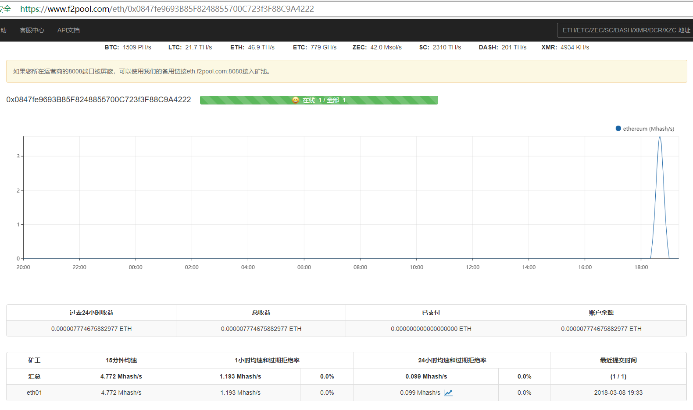

### ETH 以太币

* ALISURE: `0x0847fe9693B85F8248855700C723f3F88C9A4222`

* XYN: `0x7FD27955637eB54088FE9052AF988916F779b627`


### 生成钱包

> [http://www.myetherwallet.com/](http://www.myetherwallet.com/)

* 教程见：[以太坊(显卡)挖矿指南](以太坊(显卡)挖矿指南.pdf)


### 前提条件

> 由于我是搞深度学习的，所以我使用的工作站上已经安装和配置好了必要的软件环境。

* NVIDIA GPU，可以安装CUDN的NVIDIA GPU
* 安装CUDN，显卡驱动


### 获取挖矿软件

> [https://github.com/ethereum-mining/ethminer](https://github.com/ethereum-mining/ethminer)

* 直接下载即可：[https://github.com/ethereum-mining/ethminer/releases](https://github.com/ethereum-mining/ethminer/releases)

* 从源码编译：**Ubuntu + OpenCL**

    1. Clone ethminer and Make sure git submodules are up to date
    ```bash
    git clone https://github.com/ethereum-mining/ethminer.git
    git submodule update --init --recursive
    ```
    
    2. Create a build directory and Configure the project with CMake.
    ```bash
    mkdir build; cd build
    # 若使用OpenCL,则使用默认即可
    cmake ..
    ```
    配置选项：`Ubuntu + CUDA`没有成功，所以改成了`Ubuntu + OpenCL`
    ```bash
    # cmake .. -DETHASHCUDA=ON -DETHASHCL=OFF
    # -DETHASHCL=ON - enable OpenCL mining, ON by default,
    # -DETHASHCUDA=ON - enable CUDA mining, OFF by default.
    ```
    
    3. Build the project using CMake Build Tool Mode. This is a portable variant of make.
    ```bash
    cmake --build .
    ```
    
    4. Result in `build/ethminer/` and test.
    ```bash
    cd build/ethminer/
    chmod +u ethminer
    ethminer --help
    ```

    5. Use OpenCL on Linux must install OpenGL libraries. 
    ```bash
    sudo apt-get install mesa-common-dev
    ```

* Reference: [https://github.com/ethereum-mining/ethminer](https://github.com/ethereum-mining/ethminer)


### 开始挖矿

1. 执行下列命令
```bash
cd build/ethminer/
chmod +u ethminer
ethminer --farm-recheck 2000 -SP 1 -G -S eth.f2pool.com:8080 -SF backup-eth.f2pool.com:8080 -O 0x0847fe9693B85F8248855700C723f3F88C9A4222.eth01
```

语法解析
```bash
ethminer -G --farm-recheck <n> -SP <n> -S <host:port> -SF <host:port> -O <username.workername:password> 
# --farm-recheck <n> : Leave n ms between checks for changed work.
# -SP <n> : Choose which stratum protocol to use.
# -G : When mining use the GPU via OpenCL.
# -S <host:port> : Put into stratum mode with the stratum server at host:port.
# -SF <host:port> : Failover stratum server at host:port.故障转移地址
# -O <username.workername:password> : Stratum login credentials.
```

2. 查看收益
```html
# 网页中访问
# https://www.f2pool.com/eth/<address>
# ALISURE
https://www.f2pool.com/eth/0x0847fe9693B85F8248855700C723f3F88C9A4222
# XYN
https://www.f2pool.com/eth/0x7FD27955637eB54088FE9052AF988916F779b627
```




3. 问题
    * 不知道为什么挖到的币会减少。。。可能是矿池有问题，或者是我还没有懂这一切是怎么回事。
    

### 其他

* [https://www.f2pool.com](https://www.f2pool.com)账户: [562282219@qq.com](a****6)


